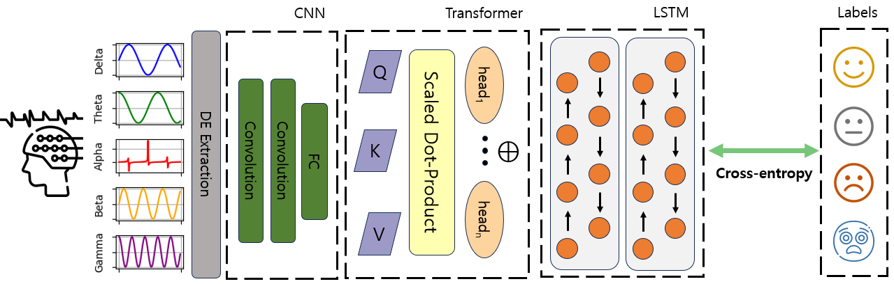

# ConTL

Code for the [ICPR 2024](https://icpr2024.org/) paper [Cascading global and sequential temporal representations with local context modeling for EEG-based emotion recognition](archive link)

<p align="center">
  
</p>

### Data Download

 - Download [SEED-IV](https://bcmi.sjtu.edu.cn/home/seed/seed-iv.html)
 - Download [DEAP](https://www.eecs.qmul.ac.uk/mmv/datasets/deap/)

### Citation

If this code is useful for your research, please cite us at:

```
@article{kang2024ConTL,
  title={Cascading global and sequential temporal representations with local context modeling for EEG-based emotion recognition},
  author={Hyunwook, Kang, Jin Woo, Choi, and Byung Hyung, Kim},
  conference={International Conference on Pattern Recognition},
  year={2024}
}
```

### Contact

For any quetions, please email at [hyunwook.kang@inha.edu](mailto:hyunwook.kang@inha.edu)
